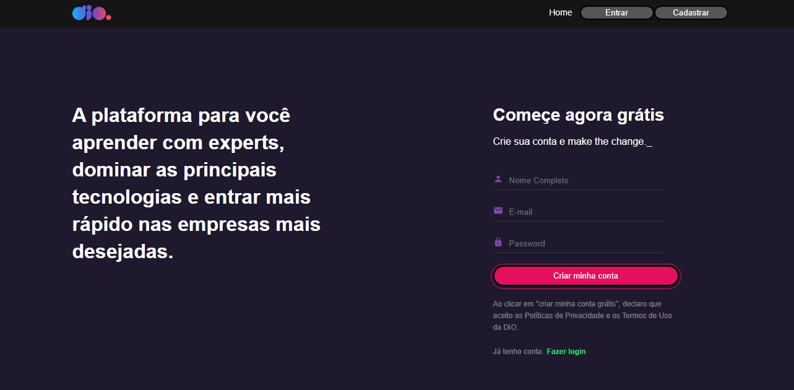

<h1 align="center"> Dio.me - Bootcamp OrangeTech + Inter </h1>

Evento exclusivo e gratuito, promovido pela Digital Innovation One para ensino de Javascript e React.

  <a href="#-tecnologias">Tecnologias</a>&nbsp;&nbsp;&nbsp;|&nbsp;&nbsp;&nbsp;
  <a href="#-projeto">Projeto</a>&nbsp;&nbsp;&nbsp;|&nbsp;&nbsp;&nbsp;
  <a href="#memo-licença">Licença</a>

  

 

  

## 🚀 Tecnologias

Esse projeto foi desenvolvido com as seguintes tecnologias:

- ReactJS
- Styled Components
- Git e Github

## 💻 Projeto

Desenvolvimento de um clone do site da Digital innovation One - DIO.

Para executar o projeto, primeiro deve ser executado o comando `npm install` ou `yarn install` para instalar as dependências. Após isso deve executar o comando `npm start` ou `yarn start` o projeto será rodado em [http://localhost:3000](http://localhost:3000)

## :memo: Licença

Esse projeto está sob a licença MIT.

---
